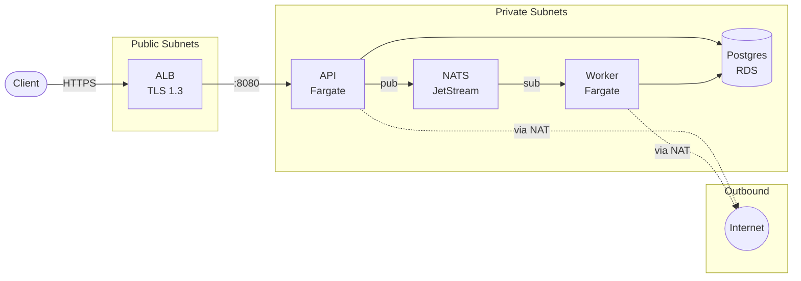
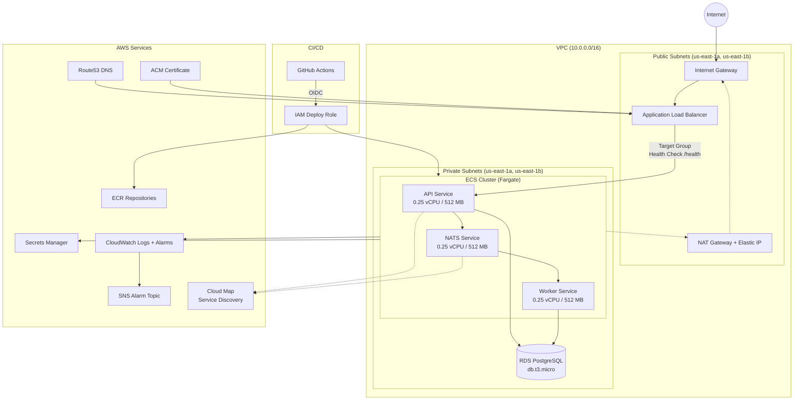

# Trading Platform

A minimal order processing service deployed on AWS ECS Fargate, with full infrastructure as code.

**Live URL:** https://dev.platform-test.click

## Architecture



## AWS Infrastructure



All application tasks run in private subnets with no public IPs. The ALB terminates TLS in public subnets and forwards traffic to the API. NATS provides async messaging via Cloud Map service discovery DNS.

## Project Structure

```
├── app/                        # Go application code
│   ├── cmd/api/                # HTTP API server
│   ├── cmd/worker/             # Queue consumer
│   └── internal/               # Shared packages (database, logging, queue, middleware)
├── docker/                     # Dockerfiles (distroless, multi-stage)
├── infra/
│   ├── bootstrap/              # One-time setup (S3 state, DynamoDB lock, OIDC, ECR)
│   ├── modules/
│   │   ├── ecs-cluster/        # Shared ECS cluster, IAM, security groups, service discovery
│   │   ├── ecs-service/        # Reusable per-service module (task def, service, logs)
│   │   ├── vpc/                # VPC, subnets, NAT, routing
│   │   ├── rds/                # Postgres RDS instance + secrets
│   │   ├── alb/                # Application Load Balancer + target groups
│   │   ├── dns/                # ACM certificate
│   │   └── observability/      # CloudWatch alarms, SNS
│   └── environments/
│       ├── dev/                # Dev config (deployed live)
│       └── prod/               # Prod config (plans cleanly, different sizing)
├── .github/workflows/          # CI/CD pipeline
└── docs/                       # Cost estimate and evidence
```

## Getting Started (Zero to Deployed)

### Prerequisites

- Go 1.21+
- Docker
- Terraform 1.7+
- AWS CLI configured with a profile named `myaws`
- A domain with Route53 hosted zone
- GitHub repository with `AWS_ROLE_ARN` secret set

### 1. Bootstrap (run once from laptop)

```bash
cd infra/bootstrap
terraform init
terraform apply
```

This creates:
- S3 bucket for Terraform state
- DynamoDB table for state locking
- GitHub OIDC provider + deploy role
- ECR repositories for Docker images

### 2. Push to main

Every push to `main` triggers the pipeline:

```
Build & Push Images → Deploy Dev (apply) → Plan Prod
```

The pipeline:
1. Builds Docker images and pushes to ECR
2. Runs `terraform apply` for dev
3. Waits for ECS services to stabilize
4. Runs `terraform plan` for prod (validates but doesn't apply)

### 3. Verify

```bash
curl https://dev.platform-test.click/health     # {"status":"ok"}
curl https://dev.platform-test.click/ready      # {"status":"ready"}
curl -X POST https://dev.platform-test.click/orders  # {"id":"<uuid>"}
curl https://dev.platform-test.click/orders/<id>     # {"id":"...","status":"filled"}
```

### Local Development

```bash
docker compose up -d   # Starts Postgres + NATS locally
cd app && go run ./cmd/api
cd app && go run ./cmd/worker
```

## Key Design Decisions

See [ARCHITECTURE.md](ARCHITECTURE.md) for 5 key decisions with tradeoffs.

## Cost

Dev stack runs under **$50/month**. See [docs/COST_ESTIMATE.md](docs/COST_ESTIMATE.md) for itemised breakdown.

## Security & Hardening

- **Containers:** Distroless base, non-root user, read-only root filesystem
- **Network:** Private subnets, no public IPs, NAT for outbound only
- **Secrets:** Stored in Secrets Manager, injected via ECS task definition
- **Auth:** GitHub Actions uses OIDC federation (no static credentials)
- **TLS:** TLS 1.3 enforced via ALB security policy
- **Deploys:** Circuit breaker with automatic rollback on failure

## Observability

- Structured JSON logs with request ID propagation (API → NATS → Worker)
- CloudWatch alarms: CPU (ECS + RDS), 5xx errors, unhealthy targets, storage
- SNS topic for alarm notifications
- CloudWatch Container Insights enabled

## With More Time

1. **Auto-scaling** — CPU/memory-based scaling policies for API and worker tasks
2. **WAF** — AWS WAF on the ALB for rate limiting and common attack protection
3. **Terraform remote state per environment** — separate state locking per workspace with proper access controls
4. **Database migrations in CI** — run migrations as a one-off ECS task before deploying new code
5. **Prometheus + Grafana** — richer application metrics beyond CloudWatch (p99 latencies, queue depth, custom business metrics)
6. **Prod approval gate** — GitHub Environments with required reviewers before prod apply
7. **Secrets rotation** — automatic RDS password rotation via Secrets Manager Lambda

## AI Usage Disclosure

AI tools (Kiro / Claude) were used as a development accelerator for:
- Terraform module scaffolding and debugging IAM permission errors
- Dockerfile optimization
- CI/CD workflow iteration
- Documentation drafting

All code was reviewed, understood, and validated by the author. Every architectural decision and tradeoff was made deliberately.
